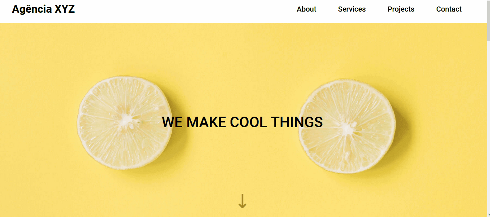

# 💼 Agência XYZ

Projeto responsivo de landing page sobre uma agência fictícia usando flex e grid.

 

## 📌 Seções
O site possui quatro partes:

- **About**: Sessão com uma explicação sobre a agência.
- **Services**: Serviços que são oferecidos pela agência.
- **Projects**: Exemplos de projetos feitos pela agência.
- **Contact**: Rodapé com links para as redes sociais.

 

## 💡 Linguagens
O site foi feito utilizando apenas:

- `HTML`: Usado para fazer a estrutura do site.
- `CSS`: Usado para a estilização do site.

 

## 📱 Mobile

